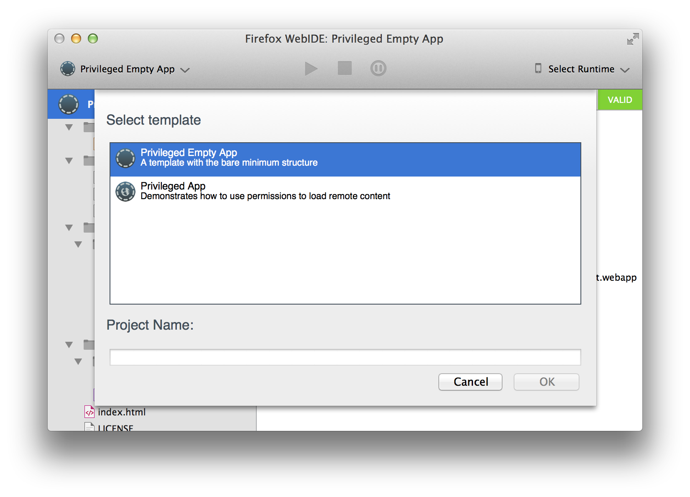

# mortar+devtools

_One project to build them all, and in the darkness distribute and bind them to your devtools._

Now seriously. This is a project to build the template + metadata files we upload to a CDN so that Firefox DevTools' [WebIDE](https://developer.mozilla.org/en-US/docs/Tools/WebIDE) can present a nice list of templates for you to kick start your app.



## I'm in! How?


````bash
git clone https://github.com/mozilla/mortar-devtools.git --recursive
cd mortar-devtools
npm install # make sure all dependencies are installed
node build.js
````

This generates a `dist` folder with the content that WebIDE will present when you click "New App". But this has to be uploaded somewhere.

To upload to a server, ensure you have a config file with the proper settings in place. A sample `config.local.json` file that you can use as a base is provided:

````bash
cp config.local.json config.json
````

Edit it to suit your needs and then you can run the script that automatically uploads things to the server:

````bash
node upload.js
````

The provided script assumes that you have uploaded a public key to the other server and that you can use SCP so it's a very specific example. You can also upload the entire contents of the folder with any other method (e.g. with an SFTP/S3 client).

We upload it to a CDN for production, but to test with your own server you can change the URL that WebIDE pulls the JSON file with templates info from. Go to `about:config` and edit `devtools.webide.templatesURL` to point to the URL of the JSON file in your server.

You can also pass in options from the command line. These will override the values in the `config.json` file. It can be useful if you want to experiment with different settings but do not want to edit the config file. For example:

````bash
node build.js --remote-directory http://somewhere/else/
````

will use that setting temporarily.

## Directory structure in `templates/`

For each template we want to include, we'll create a directory under `templates`.

Then add **a git submodule** for the template in a `src` subdirectory. For example, this is how you would add the `app-stub` template:

````
cd mortar-devtools/templates
mkdir app-stub
cd app-stub
git submodule add https://github.com/mozilla/mortar-app-stub.git src
````

An **icon** for the template is required too (this will be shown in the WebIDE when listing the available templates). Icon format is **PNG**.

## Pending stuff

- Generate JSON for devtools
  - Where does the data for each entry come from? title, description
    - Each template folder?
- Probably refactor common functions that will arise as more templates are added
- Things to test
  - For each template in templates/ there must be a generated ZIP file
  - Each ZIP must contain a valid project
    - how can we say something is "a valid project"?
      - It can be unzipped and has > 0 files
      - MD5?
- How do we get this into a public server?
  - check in the dist files
  - or make a task to upload to some FTP
    - then also need the MD5
